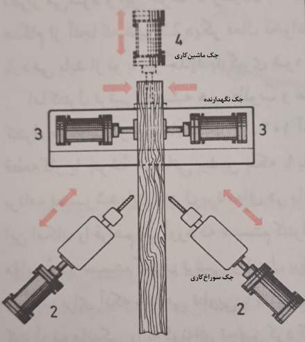
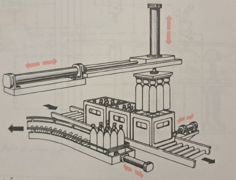

# Industrial Control: First Midterm Examination

**English translation of the Persian question paper**

Instructor: Dr. Mohammad Azam Khosravi  
Teaching assistants: Hanieh Maroufkhani; Ali Salehi; Mehdi Shahini; Amir Arshia Ahmadi  
Date: Aban 1403 (Solar Hijri calendar)

Source: [original Persian question paper](exam-questions-fa.pdf), 9 PDF pages. Names are transliterated from Persian. The instructions below are translated historical exam requirements, not new submission instructions. Repeated page headers and footers are omitted; question numbering and figure/table labels are retained.

## General instructions

*Source: PDF page 2; printed page 1.*

- Submit the take-home examination answers no later than 09:00 on 19 Aban 1403.
- Design each simulation exercise using the appropriate software. Then record a short video, no longer than five minutes per question, using oCam. Explain the design, why the relevant components were used, and how the circuit operates.
- Upload the answers to the `courses` system as an archive.
- Name the archive `TakeHome_1_studentnumber`, where `studentnumber` is your student ID. The archive must contain the typed report, simulation files, and recorded videos.
- Recommendation: implement and simulate each FluidSIM and PLC process step by step. Avoid attempting to simulate the entire process in a single step.
- To use the supplied Factory I/O scene files, place them in the following location in the Windows installation where the software is installed: `Documents/Factory IO/My Scenes`.

Good luck.

## FluidSIM section

### Question 1: Pneumatic simulation of an automatic wood-turning process

*Source: PDF page 3; printed page 2. Repository exercise 01.*

Design a system, shown in Figure 1, that begins the process when the Start pushbutton is pressed. The simulation sequence is:

1. First, two holding cylinders activate and secure the wooden workpiece.
2. After one second, the machining cylinder activates.
3. The machining cylinder remains active for five seconds and then deactivates. Immediately afterward, the drilling cylinder activates.
4. The drilling cylinder also remains active for five seconds and then deactivates.
5. After drilling is complete, the holding cylinders release and the process ends.

**Figure 1. Process schematic.** Translation of the Persian labels: **4**, machining cylinder; **3**, holding cylinders; **2**, drilling cylinders. This is the original assignment diagram, not a new simulation result.

### Question 2: Separating ferrous from non-ferrous parts in each box

*Source: PDF page 4; printed page 3. Repository exercise 02.*

**Figure 2. Process schematic.**

When the Start pushbutton is pressed, the following steps occur in order:

1. The holding cylinders activate and keep the box of parts stationary on the conveyor.
2. The vertical cylinder, equipped with a magnet, activates. The magnetic field at the end of its rod attracts the ferrous parts from the box. After the parts have been picked up, the vertical cylinder and the box-holding cylinders return to their initial positions.
3. Once the vertical cylinder has returned to its initial position, the horizontal cylinder activates and transfers the picked-up parts toward the adjacent conveyor.
4. After reaching the adjacent conveyor, the vertical cylinder activates again and places the ferrous parts on the adjacent table.
5. The vertical and horizontal cylinders then return to their initial positions.
6. A guiding cylinder pushes the parts off the second conveyor and immediately deactivates.

**Note:** It is not necessary to model the vertical cylinder's end effector, namely the magnet.

## PLC section

### Question 1: Traffic-light control at an intersection

*Source: PDF page 5; printed page 4. Repository exercise 03.*

There are two traffic lights at an intersection. Activating the Start switch enables the lights. Their illumination sequence is:

| Stage | Duration | Light 1 | Light 2 |
| --- | --- | --- | --- |
| First | 20 seconds | Green | Red |
| Second | 7 seconds | Yellow | Yellow |
| Third | 20 seconds | Red | Green |

The cycle repeats. Implement the described process.

### Question 2: Sorting boxes according to height

*Source: PDF page 6; printed page 5. Repository exercise 04.*

The objective is to classify boxes according to their heights. Design and implement a height-detection system that identifies three box categories: `Box(M)`, `Box(L)`, and `Palletizing Box`.

- **Sensor configuration:** Configure a height sensor to distinguish the three height categories. Select its exact settings according to the program's requirements so that box height is detected correctly.
- **Box selection and movement timing:** Select the specified box types in the `Emitter(0)` block. Adjust the delay between the creation of boxes according to the program.
- **Counting each category:** Write the program so that the number of boxes in each category is shown on that category's display.
- **Pushbutton control:** Pressing Start begins classification, and pressing Stop stops the process. A third pushbutton, Reset, resets the counter.

**Note:** Pay attention to the sensors, time delays, and input/output configuration so that the program operates correctly.

**Reminder:** In Factory I/O, the Stop input is 1 by default. When Stop is activated, its input becomes 0.

### Question 3: Palletizing boxes

*Source: PDF page 7; printed page 6. Repository exercise 05.*

Two conveyors are provided, each designed for a different task:

- **Box Conveyor:** A Box Emitter produces boxes. Configure its timing so that `Box(M)` is generated with an appropriate delay. The conveyor carries each box to the end of its path. As soon as the box reaches the limit switch at the end, the Box Conveyor stops.
- **Pallet Conveyor:** A Pallet Emitter produces pallets. Set its input type to `Pallet`, with an appropriate creation delay. Each pallet is then transferred to the loading position. When it reaches the designated position, a sensor detects the pallet and the conveyor switches off.
- **Pick & Place:** The robot must take the box that has reached the end of the Box Conveyor and place it on the pallet. The Box Conveyor then starts again to bring another box to its end. The Pick & Place robot must place this second box on top of the previous box. Once the pallet carries two boxes, the source states that the Pallet Emitter starts and brings a new pallet toward the loading position.
- A counter records the number of completed pallets. Pressing the Reset pushbutton returns this counter to zero.
- Start and Stop pushbuttons control the overall operation.

**Note:** Sensors may be repositioned, but the conveyors must not be moved.

**Reminder:** The Factory I/O Stop input is 1 by default and becomes 0 when activated.

### Question 4: Heating furnace

*Source: PDF pages 8-9; printed pages 7-8. Repository exercise 06.*

In this process, material enters a heating furnace, is fired, and leaves after a specified time. The furnace heat strengthens the molecular bonds of the produced material.

#### Process equipment

- **Conveyor:** A conveyor moves material through the furnace continuously. One motor is the main motor; a second is used as a reserve motor.
- **Gas burners:** Several gas burners on the two sides of the furnace provide heat. Two control valves regulate the gas supplied to the burners. At a command current of 4 mA, the valves are fully closed. At 20 mA, they are fully open. Between 4 and 20 mA, valve opening is proportional to the received current.
- **Thermocouple:** A thermocouple measures furnace temperature. A transmitter converts its signal to a current signal. At a temperature of -100 degrees, the transmitter supplies 4 mA to the analog input card; at 1000 degrees, it supplies 20 mA.

#### Program logic

Pressing Start turns on the main motor first. If the main motor develops a fault, pressing Stop turns on the reserve motor after ten seconds. Pressing Stop again also turns off the reserve-motor system.

Whenever one of the motors is running, use the analog output (AO) card to send a current signal to the control valves according to Table 1. When both motors are off, the valves must be fully closed.

As described above, the valve current depends on furnace temperature. The source text states that the signal gradually increases as temperature rises and gradually decreases once the furnace reaches 500 degrees. This is intended to prevent a severe abrupt change at the control valves. It also notes that, in practice, processes of this kind use closed-loop control.

**Table 1. Temperature ranges and the required current sent to the control valves.**

| Temperature range, degrees | Current command |
| --- | --- |
| Below 50 | 5 mA |
| Between 50 and 100 | 7 mA |
| Between 100 and 150 | 9 mA |
| Between 150 and 180 | 11 mA |
| Between 180 and 300 | 14 mA |
| Between 300 and 400 | 14 mA |
| Between 400 and 550 | 18 mA |
| Between 550 and 600 | 16 mA |
| Between 600 and 650 | 14 mA |
| Between 650 and 660 | 12 mA |
| Between 660 and 690 | 10 mA |
| Between 690 and 720 | 8 mA |
| Between 720 and 730 | 6 mA |
| Between 730 and 750 | 5 mA |
| Above 750 | 4 mA |

## Translation notes

1. Question numbering restarts at 1 in the PLC section. Consequently, PLC questions 1-4 correspond to repository exercises 03-06.
2. The palletizing statement calls the device that starts after loading two boxes the **Pallet Emitter**. That wording is preserved; the precise conveyor/emitter sequence should be checked in the implementation.
3. The furnace paragraph refers to a change at **500 degrees**, while Table 1 places the highest current in the **400-550** band. Both source statements are retained.
4. The source uses “between” for temperature intervals without defining inclusion of the endpoints. This translation does not invent boundary rules.
5. Technical requirements are translated as stated. Their presence in this document does not establish that the supplied implementation satisfies them or that a physical system was tested.
