# Industrial Control Midterm: Supplementary Simulation Report

**English translation of the Persian report**

Amirkabir University of Technology (Tehran Polytechnic)  
Department of Electrical Engineering, Control specialization  
Author: Ali Ramezanzadeh  
Instructor: Dr. Mohammad Azam Khosravi  
Date: Aban 1403 (Solar Hijri calendar)

Source: [original Persian report](report-fa.pdf), 39 PDF pages. This is a reflowed translation of the narrative, headings, figure captions, and tables. Original circuit and ladder screenshots are reproduced as source figures. Repeated headers, footers, and duplicate index entries are omitted. Source chapter, section, figure, and table numbers are retained. Statements about operation and videos below are the original author's statements; they are not newly verified results. Editorial translation notes are collected at the end.

## Contents and source-page mapping

| Source chapter | Subject | Printed pages | PDF pages |
| --- | --- | --- | --- |
| 1 | Introduction | 2 | 6 |
| 2 | Question 1: pneumatic machining | 3-6 | 7-10 |
| 3 | Question 2: pneumatic part separation | 7-11 | 11-15 |
| 4 | Question 3: traffic lights | 12-15 | 16-19 |
| 5 | Question 4: box classification | 16-21 | 20-25 |
| 6 | Question 5: palletizing | 22-28 | 26-32 |
| 7 | Question 6: furnace control | 29-35 | 33-39 |

The source's preliminary pages contain its cover, contents, figure list, and table list. All sixteen figures and four tables listed there appear below under their original labels.

## Chapter 1. Introduction

### 1.1 Explanatory notes

To avoid making the report excessively long, not every network image is included here. However, all related files are included in full in the attachment. Consult the attached files for additional details and a closer examination of each network's operation.

Videos were also prepared to provide supplementary explanations and a better understanding of the processes and circuit operation. They visually examine the networks and system movements step by step. Watching these videos is recommended for a fuller and clearer understanding of each stage's operation and details.

For Questions 4 and 5, the problem statements did not specify exactly how stopping should occur. Several stopping modes were considered for each question, and one was implemented as an example.

## Chapter 2. Question 1

### 2.1 Question explanation

This part examines and simulates the pneumatic process of a wood-turning machine in FluidSIM. The main objective is to design and implement a system that begins operating when a pushbutton is pressed and automatically performs the wood-turning process. The process controls holding, machining, and drilling cylinders, each of which activates and deactivates at specified times.

Pneumatic principles and precise timing are used to carry out the following sequence:

1. Activate the holding cylinders to secure the workpiece.
2. Activate the machining cylinder after one second.
3. Keep the machining cylinder active for five seconds, then activate the drilling cylinder.
4. Deactivate the drilling cylinder after five seconds and finish the process.

The report discusses the design stages, simulation, and results obtained by running the FluidSIM simulation. The related files were submitted in an archive.

### 2.2 Pneumatic circuit explanation

The circuit designed in FluidSIM controls three principal actuator roles:

- **A: Support Cylinder:** holds the workpiece in its initial position.
- **B: Machinist Jack:** performs machining on the workpiece.
- **C: Drilling Jack:** performs the drilling operation.

#### 2.2.1 Operating stages

1. **Start:** Pressing Start begins the process and sends a signal to the control valves, preparing the actuators for operation.
2. **Activate the support cylinder, A+:** Immediately after starting, cylinder A activates. A double-acting pneumatic valve controls it, and the cylinder extends to hold the workpiece stationary.
3. **Activate the machining cylinder, B+:** One second after A activates, the machining cylinder activates through a double-acting control valve, positioning the workpiece appropriately for machining.
4. **Return the machining cylinder, B-:** Five seconds after extension, timer 2 causes the cylinder to retract.
5. **Activate the drilling cylinder, C+:** Cylinder C extends after B retracts.
6. **Return the drilling cylinder, C-:** Five seconds after extension, timer 3 causes C to retract.
7. **Return the support cylinder, A-:** Finally, after C retracts, A returns to its initial position.

**Note:** The question is interpreted as requiring one cycle for each pushbutton press, rather than continuous repetition. The program follows this interpretation.

### 2.3 Circuit operation

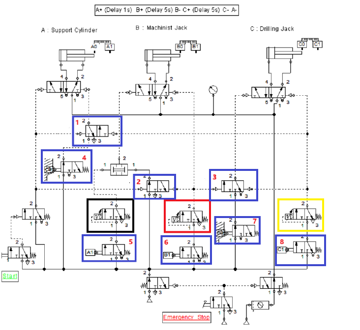

**Figure 2.1. Pneumatic circuit simulation in FluidSIM.**

#### 2.3.1 Control valves

The circuit contains several 3/2 valves. Control valves 1, 2, and 3 are highlighted with blue boxes in Figure 2.1. They regulate the cycle in parts of the circuit where retained signals could occur. They may be regarded as serving the role of cascade valves, because they are not connected in parallel with the relevant state.

#### 2.3.2 Time delays

Time delays precisely coordinate actuator activity so that the process occurs in sequence at specified intervals:

- Timer 1, highlighted in black, creates a one-second delay between A+ and B+.
- Timer 2, highlighted in red, creates a five-second delay between B+ and B-.
- Timer 3, highlighted in yellow, creates a five-second delay between C+ and C-.

#### 2.3.3 Emergency-stop pushbutton

A button labeled Emergency Stop is provided at the bottom of the circuit. Pressing it immediately stops all processes.

#### 2.3.4 Pneumatic switches

The pneumatic switches produce signals according to whether their associated cylinders are extended or retracted. These signals activate the appropriate timers and valves so that the operations follow the specified order. Switches 4-8 are identified with blue boxes.

The switches connected to exhaust are handled this way because all cylinders are retracted when the system is off, activating the switches with the suffix 0. Auxiliary valves block these signals so that the switches do not trigger the process by themselves.

## Chapter 3. Question 2

### 3.1 Question explanation

This section examines a pneumatic simulation for separating ferrous from non-ferrous parts. The system separates parts according to their magnetic properties: a vertical magnetic cylinder identifies and picks up ferrous parts and transfers them from the conveyor to a designated location.

The system consists of:

- Holding cylinders to secure boxes on the conveyor.
- A vertical cylinder equipped with a magnet to attract and lift ferrous parts.
- A horizontal cylinder to transfer ferrous parts to the storage/separation location.
- A conveyor to move the parts and guide the non-ferrous parts toward the end of the path.

### 3.2 Simulation in FluidSIM

FluidSIM is used to implement the pneumatic circuit. The operating stages are:

1. Pressing Start activates the holding cylinders and secures the boxes.
2. The vertical magnetic cylinder activates, separates the ferrous parts from the boxes, and lifts them.
3. The horizontal cylinder receives the ferrous parts from the vertical cylinder and transfers them toward the adjacent conveyor.
4. After the ferrous parts are released, the cylinders return to their initial positions, and the non-ferrous parts continue along their path.

The circuit controls four principal actuator roles:

- **A:** Support Cylinder.
- **B:** Vertical Jack.
- **C:** Horizontal Jack.
- **D:** Guiding Jack.

Its purpose is to execute a specified sequence of movements and operations, with each actuator activated and deactivated at the appropriate time:

1. Extend the support cylinder: A+.
2. Extend the vertical cylinder: B+.
3. Retract the vertical and support cylinders simultaneously: B-, A-.
4. Extend the horizontal cylinder: C+.
5. Extend the vertical cylinder again: B+.
6. Retract the vertical and horizontal cylinders simultaneously: B-, C-.
7. Extend the guiding cylinder, D+, then return it to its initial position, D-.
8. Repeat the process in the specified order.

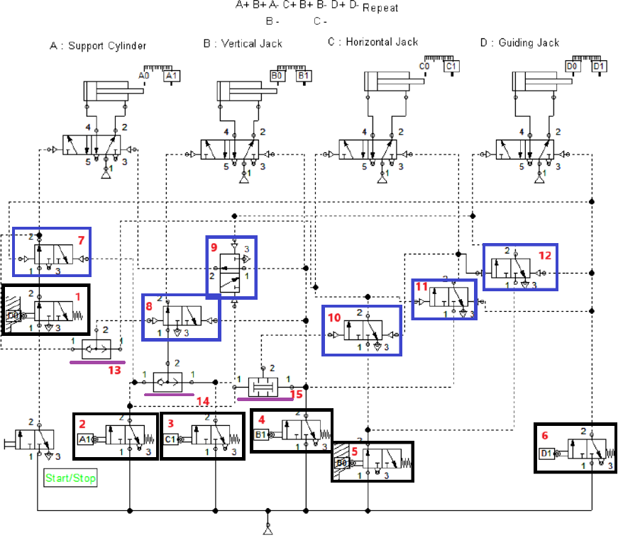

**Figure 3.1. Implementation of the Question 2 circuit in FluidSIM.**

#### 3.2.1 Starting the process

Pressing Start/Stop enables the circuit and directs airflow toward the control valves. The valves regulate airflow direction and timing so that each actuator activates at a specified time. The Start button is maintained because the circuit repeats.

#### 3.2.2 Control valves: boxes 7-12

The circuit consists of various pneumatic valves. Implementing the simulated sequence directly, without auxiliary measures, would produce retained-signal problems. These occur when signals cannot follow their intended paths correctly, disrupting the sequence.

Auxiliary valves address this problem. Their behavior permits each movement at the appropriate time, changing state in response to pneumatic signals. By directing the signals correctly, they preserve the operating sequence and prevent retained signals, allowing the circuit to continue without disruption.

#### 3.2.3 Pneumatic logic valves: boxes 13-15

Several AND and OR valves are used. For example, cylinder B must activate twice from different signals. An OR valve allows either signal to trigger B and initiate movement.

An AND valve provides more precise control and establishes the required sequence. Under specific conditions, simultaneous signals change an auxiliary valve's state. The source gives the example that when cylinders B and C are simultaneously in the positive state, cylinder C retracts. Combining AND and OR valves provides the coordination needed for precise and continuous operation.

The control valves also combine signals from the cylinders' initial and final positions. These indicate their current extended or retracted states and allow the auxiliary valves to make the logical decisions required for each process stage. Each cylinder activates or deactivates only when the appropriate combination of signals is present, supporting coordinated execution in the correct order.

#### 3.2.4 Pneumatic switches

1. **Box 1:** A spring-return 3/2 valve actuated when D is retracted. It is active initially because all cylinders are retracted. Its output feeds auxiliary valve 7 so that pressing Start can extend A.
2. **Box 2:** A 3/2 valve actuated when A is extended. Its output goes to OR valve 14 so that B can extend at the required time. Two additional pneumatic signals go to valve 7 to put it into the exhaust state and to AND valve 15 to enable valve 10 when B is fully extended.
3. **Box 3:** A 3/2 valve actuated when C is extended. Its output also goes to OR valve 14 to extend B at the appropriate time. Another signal goes to valve 9, putting it into the exhaust state once C is fully extended, so that the second extension of B does not send another signal to A.
4. **Box 4:** A 3/2 valve actuated when B is extended. Several signals are taken from it because B extends and retracts twice in one cycle. The first signal supports stage 3 by retracting B and A. Another goes to valve 15: when A and B are both extended, valve 10 can open, allowing C to extend after stage 3 rather than earlier. The signal also changes valve 8's state to avoid retained signals during the cycle. Valve 7 changes state after A has extended once, blocking its path so that A does not extend again in the same cycle.
5. **Box 5:** A 3/2 valve actuated when B is retracted. It connects directly to valve 10, which controls C's extension. It also supports opening valve 11, which later causes D to extend. Because all cylinders are retracted when the circuit is off, this valve is then in its second state.
6. **Box 6:** A 3/2 valve actuated when D is extended. Besides retracting D, it resets several control valves. Valves 7 and 12 reset to return the circuit to its initial state. If Start remains enabled, the cycle repeats.

## Chapter 4. Question 3

### Introduction

The question requires a ladder program controlling the traffic lights at an intersection. Pressing Start begins the system, which has three timed stages:

1. Light 2 red and light 1 green for 20 seconds.
2. Lights 1 and 2 yellow for 7 seconds.
3. Light 1 red and light 2 green for 20 seconds.

**Author's note:** In my opinion, a fourth stage should follow the third stage so that the lights become yellow again.

After the three specified stages, the system returns to the first stage and repeats. This report explains the implementation and the individual ladder networks.

### 4.1 Networks

#### 4.1.1 Network 1: Start/Stop

Digital inputs start and stop the process:

- `I0.0 - Start`: starts the program.
- `I0.1 - Stop`: stops the program.
- `M0.0 - Start/Stop Mem`: stores the Start/Stop state.

#### 4.1.2 Networks 2 and 3: Start-button light

The variables used are:

- `M0.0 - Start/Stop Mem`: Start/Stop state memory.
- `Q0.6`: output for illuminating the Start-button light.
- `Q0.7`: output for illuminating the Stop-button light.
- `C0`: counter recording timer activations.
- `MW1`: memory holding the counter value.

#### 4.1.3 Network 4: Process-management counter

- `C0`: records the number of timer activations.
- `MW1`: stores the counter value.

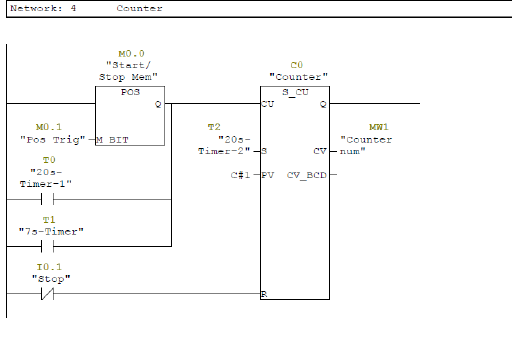

**Figure 4.1. Second network of Question 3.** The caption is retained from the original; see translation notes.

The counter moves to the next stage to activate each of the three timers, each representing one required state. A comparator selects the next portion of the sequence according to the counter value.

#### 4.1.4 Network 5: First-stage timer, green 1/red 2

- `CMP ==I MW1, 1`: compares the counter with 1.
- `T0`: first-stage timer, active for 20 seconds.

The source's next sentence describes setting the first timer to seven seconds and activating it when the counter reaches 1. Networks 6 and 7 likewise use a timer and counter to switch between the required states. The conflicting timing statement is preserved here and noted below.

#### 4.1.5 Network 6: Second-stage timer, yellow 1/yellow 2

This network activates the seven-second second timer when the counter is 2:

- `CMP ==I MW1, 2`: compares the counter with 2.
- `T1`: seven-second second-stage timer.

#### 4.1.6 Network 7: Third-stage timer, red 1/green 2

This operates like the previous networks, but its completion sends a signal to the counter to restart the process:

- `CMP ==I MW1, 3`: compares the counter with 3.
- `T2`: 20-second third-stage timer.

#### 4.1.7 Networks 8, 9, and 10

These three networks work similarly. Comparators use the counter value to illuminate the outputs for the selected stage.

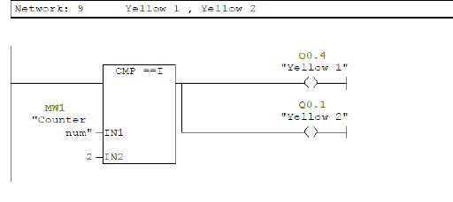

**Figure 4.2. Example from Network 9, which makes both lights yellow.**

**Table 4.1. Variables for Question 3.**

| Variable role | Type | Address | Description |
| --- | --- | --- | --- |
| Input | Bool | I0.0 | Start the cycle |
| Input | Bool | I0.1 | Stop the cycle |
| Memory | Bool | M0.0 | Start/Stop state |
| Memory Word | Int | MW1 | Stage-counter value |
| Counter | Counter | C0 | Stage counter |
| Timer | Timer | T0 | First stage, 20 seconds |
| Timer | Timer | T1 | Second stage, 7 seconds |
| Timer | Timer | T2 | Third stage, 20 seconds |
| Output | Bool | Q0.0 | Green light 2 |
| Output | Bool | Q0.1 | Yellow light 2 |
| Output | Bool | Q0.2 | Red light 2 |
| Output | Bool | Q0.3 | Green light 1 |
| Output | Bool | Q0.4 | Yellow light 1 |
| Output | Bool | Q0.5 | Red light 1 |
| Output | Bool | Q0.6 | Start light on the panel |
| Output | Bool | Q0.7 | Stop light on the panel |

## Chapter 5. Question 4

### 5.1 Question explanation

The objective is to design and implement a ladder program that processes boxes on a conveyor according to size and position. Using sensors and counters, the system should automatically divide boxes into three categories and set the appropriate memories and outputs to direct each category to its next stage.

Pressing Start moves the conveyor. Sensors measure the boxes, which are classified as P, M, or L according to their size. After classification, a cylinder directs each box to its corresponding section. The following sections explain the networks and implementation.

### 5.2 Emitter output in different states

The conveyor is first enabled in the program. The source records these values for different box types:

1. Palletizing Box: **128**.
2. M Box: **192**.
3. L Box: **224**.

The following explanation shows how these numbers and comparators distinguish the boxes.

### 5.3 Networks

#### 5.3.1 Network 1: Start and Stop

This network controls the inputs and memories associated with starting and stopping:

- `I0.0 - Start`: starts the process and enables the conveyor.
- `I0.1 - Stop`: stops the conveyor.
- `M0.0 - Start/Stop mem`: stores the Start/Stop state.

#### 5.3.2 Network 2: Conveyor movement control

- `M0.7 - On/Off Conveyor`: memory controlling the conveyor's on/off state.
- `Q0.6 - Conveyor`: conveyor output.

The video provides a fuller explanation of stopping. Briefly, if Stop is pressed while a cylinder is directing a box, the conveyor continues until the box clears the cylinder, then stops. Because the problem statement did not specify the Stop behavior, I did not treat it as an emergency stop.

#### 5.3.3 Network 3: Start button

`Q0.7 - StartButton` controls the Start-button light, indicating that the process is active.

#### 5.3.4 Network 4: Stop button

`Q1.0 - Stop Button` controls the Stop-button light, indicating that the process is inactive.

#### 5.3.5 Network 5: Reset button

- `I0.2 - Reset`: resets counters and memories.
- `Q1.1 - Reset Button`: output associated with the Reset button.

#### 5.3.6 Networks 6 and 7: Identifying and counting Palletizing Boxes

The sensors and memories associated with category P identify and count boxes according to a specified size:

- `CMP >I ID30, 100`: compares the box-height input with 100.
- `CMP <I ID30, 140`: compares it with 140. Values between these limits belong to the Palletizing Box category.
- `M0.1 - P-memory`: remembers a Palletizing Box that has passed the emitter sensor.
- `M0.4 - P-count memory`: memory for the category P count sequence, activated when the intended box also passes the sensor in front of its pusher.
- `I1.3 - Front limit-Pallet`: front limit sensor for this category's cylinder.
- `I0.5 - Palletizing sensor`: cylinder sensor for the category.

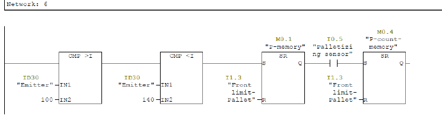

**Figure 5.1. Sixth network of Question 4.**

In Network 6, two comparators receive the height-sensor value. If it falls between their thresholds, a signal of 1 sets the first memory. When the cylinder sensor for that box type activates, the next memory is set to continue movement in Network 7. The first memory indicates that the box has passed the emitter sensor; the second indicates that it has reached the cylinder.

A range is used because, in a real system, the sensor has error and boxes within a category are not exactly identical. The range covers these variations, although a comparison with a single value could have been used instead.

- `T0`: 250-millisecond timer controlling the delay before cylinder movement.
- `Q0.5 - Pusher-Pallet`: output enabling the cylinder to move category P boxes.
- `C0 - Counter`: records the number of transferred boxes.

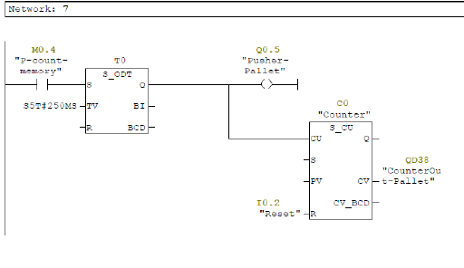

**Figure 5.2. Seventh network of Question 4.**

The timer introduces a short delay after sensor activation before the cylinder operates. Activating it too early would prevent the package from being pushed correctly onto the adjacent surface.

The other boxes are similarly identified, separated, and counted in Networks 8-11. The counter-display outputs are taken from the counters in Networks 7, 9, and 11.

#### 5.3.7 Networks 8 and 9: Identifying and counting category M

Network 8 is similar to Network 6 but configured for category M:

- `CMP >I ID30, 170`: compares the box height with 170.
- `CMP <I ID30, 205`: compares it with 205. Values between these limits belong to M.
- `M0.2 - M-memory`: records category M boxes.
- `M0.5 - M-count memory`: memory for their count sequence.
- `I1.1 - Front limit-M`: front limit sensor for the M cylinder.
- `I0.4 - M sensor`: M cylinder sensor.

Network 9 contains the timer and counter that direct category M boxes:

- `T1`: 400-millisecond movement delay.
- `Q0.4 - Pusher-M`: M cylinder output.
- `C1 - Counter`: number of transferred M boxes.

#### 5.3.8 Networks 10 and 11: Identifying and counting category L

Network 10 identifies and counts category L. The box-height value must exceed 210:

- `CMP >I ID30, 210`: identifies category L.
- `M0.3 - L-memory`: records category L boxes.
- `M0.6 - L-count memory`: memory for their count sequence.
- `I0.7 - Front limit-L`: front limit sensor for the L cylinder.
- `I0.3 - L sensor`: L cylinder sensor.

Network 11 includes the timer and counter that direct the boxes:

- `T2`: 250-millisecond movement delay.
- `Q0.3 - Pusher-L`: L cylinder output.
- `C2 - Counter`: records transferred L boxes.

**Table 5.1. Program variables for the Question 4 control circuit.**

| Variable role | Type | Address | Description |
| --- | --- | --- | --- |
| Input | Bool | I0.0 | Start pushbutton |
| Input | Bool | I0.1 | Stop pushbutton |
| Input | Bool | I0.2 | Reset button |
| Input | Bool | I0.3 | L cylinder sensor |
| Input | Bool | I0.4 | M cylinder sensor |
| Input | Bool | I0.5 | P cylinder sensor |
| Input | Bool | I0.7 | L front cylinder sensor |
| Input | Bool | I1.1 | M front cylinder sensor |
| Input | Bool | I1.3 | P front cylinder sensor |
| Output | Bool | Q0.3 | L cylinder |
| Output | Bool | Q0.4 | M cylinder |
| Output | Bool | Q0.5 | P cylinder |
| Output | Bool | Q0.6 | Conveyor on/off control |
| Output | Bool | Q0.7 | Start button |
| Output | Bool | Q1.0 | Stop button |
| Output | Bool | Q1.1 | Reset button |
| Output | Analog Output | QD30 | Final output of counter 2 |
| Output | Analog Output | QD34 | Final output of counter 1 |
| Output | Analog Output | QD38 | Final output of counter 0 |
| Timer | Timer | T0 | Timer 1 |
| Timer | Timer | T1 | Timer 2 |
| Timer | Timer | T2 | Timer 3 |
| Counter | Counter | C0 | P counter |
| Counter | Counter | C1 | M counter |
| Counter | Counter | C2 | L counter |

## Chapter 6. Question 5

### 6.1 Question explanation

The system manages and controls box movement on conveyors. Inputs, including counting sensors, timers, and memories, control box position and motion. Two conveyors move boxes and pallets, with counters and memories managing their movement states. The following sections explain each ladder network.

### 6.2 Networks

#### 6.2.1 Network 1: System Start and Stop

Network 1 controls the system's overall on/off state using the relevant inputs and memories:

- `I0.0 - Start`: begins the handling process.
- `I0.1 - Stop`: stops the system.
- `M0.0 - Start/Stop mem`: stores the system's Start/Stop state.

#### 6.2.2 Network 2: Start and Stop buttons

This network controls the button states and sends their status to the corresponding outputs:

- `Q0.0 - Start Button`: output associated with Start.
- `Q0.1 - Stop Button`: output associated with Stop.

#### 6.2.3 Network 3: Counter-reset button

The Reset Counter input resets and reinitializes the counters:

- `I0.2 - Reset Counter`: counter-reset input.
- `Q0.2 - Reset Button`: output associated with Reset.

#### 6.2.4 Network 4: Pallet-conveyor sensor

Network 4 checks pallet detection and uses rising-edge memory to store this state. The memory is set as soon as the pallet is detected:

- `I0.3 - Pallet Sensor`: pallet-conveyor sensor.
- `M0.3 - RisingEdge pallet sens`: rising-edge trigger memory.
- `M0.4 - RisingEdge pallet mem`: remembers a pallet in front of the sensor.
- `MW15 - Cycle-count`: number of handled boxes; used for resetting after two boxes have been placed on a pallet.

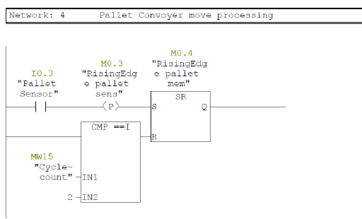

**Figure 6.1. Fourth network of Question 5.**

#### 6.2.5 Network 5: Pallet-conveyor control

Network 5 controls the pallet conveyor using inputs and memories, enabling its output. Information from the previous network determines whether the conveyor stops or moves.

**Note:** The normal Stop button is not used directly to stop this conveyor, so that a pallet already moving can leave and the next pallet can replace it. If that behavior is not desired, replace input `I2.0` with `M0.0`, as in Network 7.

- `Q0.3 - Pallet Conveyor`: pallet-conveyor output.
- `M0.1 - Memory Pallet`: pallet-conveyor control memory.

#### 6.2.6 Network 6: Box-conveyor sensor

This network works like Network 4, but for boxes. It contains a timer and the relevant memories for processing the box-conveyor sensor state. The timer ensures that, when the conveyor stops, the box center is directly beneath the mechanism.

- `I0.4 - Box Sensor`: box-conveyor sensor.
- `T0`: 100-millisecond sensor-processing delay.
- `M0.5 - RisingEdge Box sens`: rising-edge memory recording the box state.
- `MW30 - Z-Move-count`: Z-axis movement count.

#### 6.2.7 Network 7: Box-conveyor control

This section is also like Network 5, but for boxes. It controls the box conveyor through the configured memories and enables the corresponding output:

- `M0.6 - RisingEdge Box mem`: stored rising-edge state of the box sensor.
- `M0.2 - Memory Box`: box-conveyor control memory.
- `Q0.4 - Box Conveyor`: box-conveyor output.

#### 6.2.8 Network 8: Box counter

Network 8 counts passing boxes using a sensor and counter:

- `C0 - Box Counter`: box counter.
- `MW10 - Box-count`: stored box-count value.

The count is used in a series of comparisons to execute a complete movement cycle, explained under Network 13.

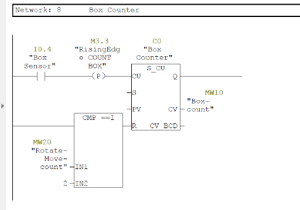

**Figure 6.2. Eighth network of Question 5.**

#### 6.2.9 Network 9: Handling-cycle counter

This network counts handling cycles and operates when the cycle count is needed:

- `C5 - Cycle Counter`: handling-cycle counter.
- `MW15 - Cycle-count`: stored cycle-count value.

The value resets the pallet-conveyor movement memory after two boxes have been placed on the pallet, allowing it to move so that the next pallet can replace it.

#### 6.2.10 Network 10: Rotation counter

Network 10 counts rotations performed by the rotation motor, whether clockwise or counterclockwise. The count is used to execute the movement sequence:

- `I1.0 - Rotating`: rotation-sensor input.
- `C2 - Rotation Counter`: rotation counter.
- `MW20 - Rotate-Move-count`: stored rotation count.

#### 6.2.11 Network 11: X-axis movement counter

Network 11 records and counts movement along the X axis:

- `C3 - X Counter`: X-axis movement counter.
- `MW25 - X-Move-count`: stored X-axis count.

#### 6.2.12 Network 12: Z-axis movement counter

Network 12 records and counts movement along the Z axis:

- `C4 - Z Counter`: Z-axis movement counter.
- `MW30 - Z-Move-count`: stored Z-axis count.

#### 6.2.13 Network 13: Z-axis movement output

When the specified conditions are met, this network activates the Z-axis output, then deactivates it so that the mechanism returns to its initial position:

- `Q0.6 - Z Out`: Z-axis movement output.

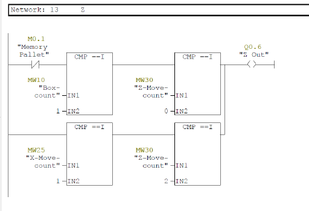

**Figure 6.3. Thirteenth network of Question 5.**

In general, counter values and comparators create the logical conditions required for particular movements at specified times. They permit the movements to occur at the appropriate moments and in the required order. This continues through Network 17, coordinating the system's operation.

The illustrated Z-axis conditions give an example: activate Z movement if a box has been detected, the pallet conveyor is inactive, and the Z-axis movement counter is 0.

#### 6.2.14 Network 14: Gripper activation, Grab

This network enables the gripper to hold a box when the specified conditions are present:

- `Q1.1 - Grab`: gripper output.

#### 6.2.15 Networks 15-17: CW, X, and CCW outputs

These networks control the different movement directions:

- `Q0.7 - CW Out`: clockwise movement.
- `Q0.5 - X Out`: X-axis movement.
- `Q1.0 - CCW Out`: counterclockwise movement.

#### 6.2.16 Network 18: Final-output count

The final-output counter is enabled, and its value is sent as `DINT` to `QD30`:

- `C6 - Out put Counter`: output counter.
- `QD30 - Output`: final output.

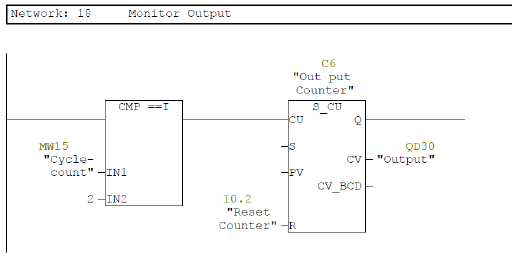

**Figure 6.4. Eighteenth network of Question 5.**

This counter counts pallets that have left the system.

**Table 6.1. Program variables for handling and counting boxes.**

| Variable role | Type | Address | Description |
| --- | --- | --- | --- |
| Input | Bool | I0.0 | Process Start |
| Input | Bool | I0.1 | Process Stop |
| Memory | Bool | M0.0 | Start/Stop state |
| Output | Bool | Q0.0 | Start-button output |
| Output | Bool | Q0.1 | Stop-button output |
| Input | Bool | I0.3 | Pallet-conveyor sensor |
| Memory | Bool | M0.3 | Pallet rising-edge memory |
| Memory Word | Int | MW15 | Number of boxes on the pallet |
| Memory Word | Int | MW10 | Box count |
| Memory Word | Int | MW20 | Rotation count |
| Memory Word | Int | MW25 | X-axis movement count |
| Memory Word | Int | MW30 | Z-axis movement count |
| Output | Bool | Q0.3 | Pallet-conveyor output |
| Output | Bool | Q0.4 | Box-conveyor output |
| Output | Bool | Q1.1 | Grab output |
| Output | Bool | Q0.5 | X-axis movement output |
| Output | Bool | Q0.6 | Z-axis movement output |
| Output | Bool | Q0.7 | Clockwise movement, CW |
| Output | Bool | Q1.0 | Counterclockwise movement, CCW |
| Output | Analog Output | QD30 | Number of pallets that have left |

## Chapter 7. Question 6

### 7.1 Question explanation

The objective is to design a furnace-temperature control system that measures temperature using a thermocouple and adjusts the control-valve input current according to that temperature. This control is intended to prevent abrupt current fluctuations and protect the valves. The thermocouple's current output is converted to a temperature between -100 and 1000, and valve current is set according to the temperature range. The following sections explain each ladder network.

### 7.2 Networks

#### 7.2.1 Network 1: Counter for motor on/off state

A counter records presses of the Start and Stop buttons to determine whether the main and reserve motors are on or off:

- `I0.0 - Start`: starts temperature and motor control.
- `I0.1 - Stop`: stops control and controls the reserve motor.
- `MW3 - Counter num`: stored counter value.
- `C0 - Counter`: counter.

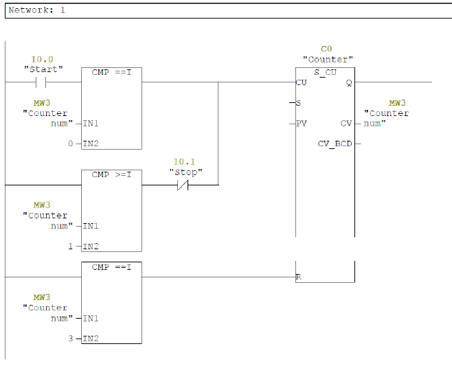

**Figure 7.1. First network of Question 6.**

#### 7.2.2 Network 2: Main-motor activation

Network 2 activates the main conveyor motor when the counter reaches 1:

- `CMP ==I MW3, 1`: compares the counter with 1.
- `Q0.0 - Motor 1`: main-motor output.

#### 7.2.3 Network 3: Reserve-motor activation with a timer

When the counter reaches 2, the timer activates. The reserve motor activates after the ten-second timer finishes.

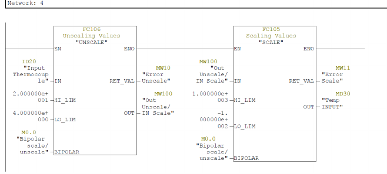

**Figure 7.2. Third network of Question 6.**

- `T0`: ten-second reserve-motor activation delay.
- `M0.1 - Reserve Motor mem`: reserve-motor control memory.
- `Q0.1 - Reserve Motor`: reserve-motor output.

#### 7.2.4 Network 4: Input-current scaling

A thermocouple supplies an analog input between 4 and 20 mA, covering temperatures from -100 to 1000. This network converts the input current to temperature using two function blocks:

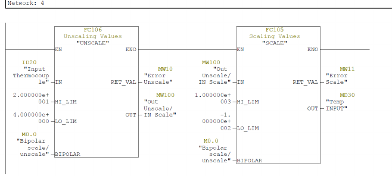

**Figure 7.3. Fourth network of Question 6.**

- `FC106 - Unscaling Values`: converts the 4-20 mA analog input to an integer in the range described in the source as **27680**, for use in the next block.
- `FC105 - Scaling Values`: converts the input value to temperature units between -100 and 1000.

#### 7.2.5 Network 5: Converting temperature to an integer

Network 5 converts the current temperature from a decimal value to an integer for comparisons:

- `MD30 - Temp INPUT`: input temperature as a decimal value.
- `MD50 - Round Temp INPUT`: input temperature rounded to the nearest integer.

#### 7.2.6 Networks 6-20: Setting outputs according to temperature range

The input temperature, previously rounded to an integer, is compared with different ranges. Each network sets the corresponding output, using the comparison result to determine the current command to the control valves. The selected value is stored in `MW40`.

| Network | Input-temperature range as described in the report | Value stored in MW40 |
| --- | --- | --- |
| 6 | Below 50 | 5 |
| 7 | Between 50 and 100 | 7 |
| 8 | Between 100 and 150 | 9 |
| 9 | Between 150 and 180 | 11 |
| 10 | Between 180 and 300 | 14 |
| 11 | Between 300 and 400 | 14 |
| 12 | Between 400 and 550 | 18 |
| 13 | Between 550 and 600 | 16 |
| 14 | Between 600 and 650 | 14 |
| 15 | Between 650 and 660 | 12 |
| 16 | Between 660 and 690 | 10 |
| 17 | Between 690 and 720 | 8 |
| 18 | Between 720 and 730 | 6 |
| 19 | Between 730 and 750 | 5 |
| 20 | Above 750 | 4 |

The report describes these values as output current commands in milliamperes.

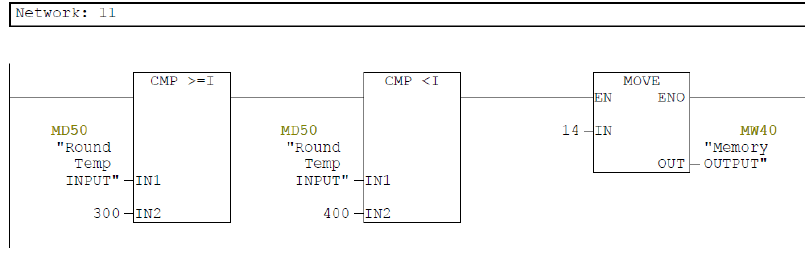

**Figure 7.4. Example of Network 11 of Question 6.**

#### 7.2.7 Network 21: Transferring the selected value to temporary memory when a motor is on

If at least one motor is active, the value selected in `MW40` is copied to `MW45`. The latter acts as a temporary buffer for output values.

**Figure 7.5. Twenty-first network of Question 6.**

- `MW40 - Memory OUTPUT`: stores the selected value.
- `MW45 - Buffer`: temporary output-value storage.

#### 7.2.8 Network 22: Zeroing buffer memory when the motors are off

If both motors are off, Network 22 transfers **4** into `MW45`, indicating the inactive system state. As specified in the question, a fully closed control valve receives 4 mA; therefore, the valves receive 4 mA when the motors are inactive.

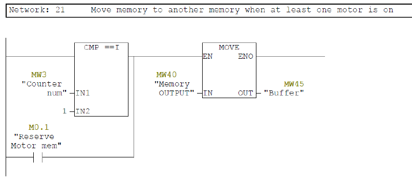

**Figure 7.6. Twenty-second network of Question 6.**

- `MW45 - Buffer`: temporary buffer assigned the value 4 in this state.

#### 7.2.9 Network 23: Final-output setting

The value stored in Buffer is transferred to the final output `QW100`, which is applied to the control valves:

- `QW100 - Output`: final output sending the appropriate temperature-control value to the valves.

**Table 7.1. Program variables for furnace-temperature control.**

| Variable role | Type as listed in source | Address | Description |
| --- | --- | --- | --- |
| Input | Bool | I0.0 | Start temperature control and the main motor |
| Input | Bool | I0.1 | Stop control and switch the reserve motor on/off |
| Memory Word | Int | MW3 | Counter value |
| Counter | Counter | C0 | Counter for changing motor states |
| Output | Bool | Q0.0 | Main-motor activation |
| Output | Bool | Q0.1 | Reserve-motor activation |
| Input | Analog Input | ID20 | Thermocouple input in mA for temperature measurement |
| Memory Word | Int | MW10 | Unscaling error storage |
| Memory Word | Int | MW11 | Scaling error storage |
| Memory Double Word | Real | MD30 | Input temperature as a decimal value |
| Memory Double Word | Real | MD50 | Input temperature rounded to an integer |
| Memory Word | Int | MW40 | Output memory for control-valve voltage |
| Memory Word | Int | MW45 | Temporary buffer for output values |
| Output | Analog Output | QW100 | Final control-valve current output |
| Timer | Timer | T0 | Ten-second reserve-motor activation delay |

## Translation notes and source inconsistencies

These notes are editorial and are not part of the original report.

1. **Original screenshots:** Figures preserve the original diagrams and ladder screenshots. Their captions and accompanying explanations are translated. Pneumatic movement notation uses `+` for extension and `-` for retraction. Original component names and PLC addresses are preserved.
2. **Video availability:** Chapter 1 and other passages mention prepared videos. No videos were included in the archive used to prepare this repository.
3. **Figure 4.1 caption:** The source calls this the second network of Question 3, but the image shows the counter network and appears in the discussion of Network 4. The source caption is retained.
4. **First traffic-light timer:** Section 4.1.4 lists T0 as 20 seconds, but its following sentence says seven seconds. The assignment and included ladder export specify 20 seconds for the first stage. The translation explicitly identifies the conflicting sentence instead of silently replacing it.
5. **Box-classification input:** Section 5.2 calls the category values emitter outputs, while Section 5.3 calls ID30 a height input and mentions an emitter sensor. Both descriptions are translated as written. Confirm the Factory I/O signal mapping before deciding how to describe the actual measured quantity.
6. **Analog terminology:** The source's tables label counter-display addresses such as QD30 “Analog Output.” This label is retained and does not establish that a physical analog output module was used.
7. **Scaling range:** Section 7.2.4 prints **27680**. This translation preserves that number; it is not a verified conversion constant or a correction to the original program.
8. **MD50 type:** The source describes conversion to an integer but lists MD50 as `Real` in Table 7.1. Both statements are retained; the native program determines the implemented type.
9. **Valve voltage/current:** Table 7.1 describes MW40 as memory for valve **voltage**, while the surrounding discussion describes **current** commands. This source inconsistency is retained.
10. **“Zeroing” in Network 22:** The source heading says the buffer is zeroed, but its text and diagram assign **4**. The translated heading preserves the original description, and the body preserves the value 4.
11. **Temperature-band boundaries:** “Between” is retained without inventing inclusive/exclusive endpoints. Boundary behavior requires checking the native comparisons.
12. **Verification:** Translation of claims about simulation operation is not independent confirmation of those claims. This repository preparation did not execute the simulations or validate physical analog outputs.
13. **Furnace screenshots:** Figures 7.2 and 7.3 both show the Network 4 conversion screenshot, although Figure 7.2 is captioned as Network 3. Figure 7.6 shows Network 21, although its caption calls it Network 22. The supplied screenshots and their original captions are retained rather than replacing them with invented diagrams.
