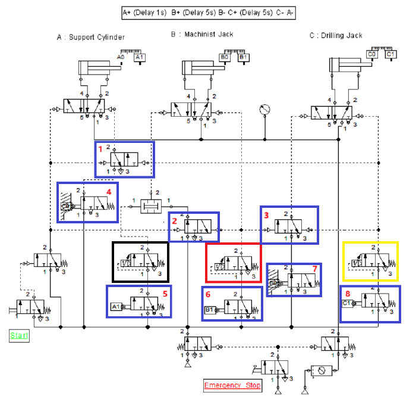

# 01. Pneumatic machining sequence

**Tools:** FluidSIM

## Objective

Sequence clamping, machining, drilling, and release for a wooden workpiece.

## Documented implementation

The documented sequence is A+ -> wait 1 s -> B+ -> wait 5 s -> B- -> C+ -> wait 5 s -> C- -> A-. A is the support cylinder, B the machining cylinder, and C the drilling cylinder. The report explains pneumatic timers, end-position switches, auxiliary valves for signal conflicts, and an emergency-stop control.

## Files

- [noname.ct](native/noname.ct): original FluidSIM circuit.
- `preview.png`: circuit figure extracted from the Persian report.

## Source documentation

[English report translation](../../docs/report-en.md) and [Persian report](../../docs/report-fa.pdf), PDF pages 7-10 (PDF page positions, not printed page numbers). The [English question paper](../../docs/exam-questions-en.md) preserves the assignment requirements. The original native files and ladder exports are preserved; this exercise README is a portfolio summary, not a new implementation.

## Running and checking

See [setup notes](../../docs/SETUP.md). Open `native/noname.ct` with the appropriate software.

Check the initial cylinder positions, run one cycle, observe the 1/5/5-second timing, and test the stop control. These are proposed checks, not recorded test results.

**Verification status:** files inspected; simulation execution and functional results not independently verified.
