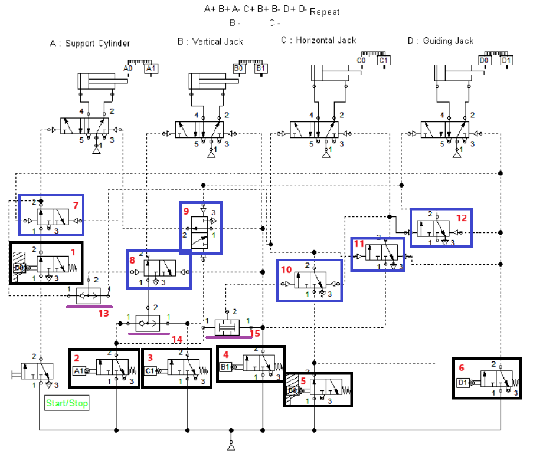

# 02. Pneumatic magnetic part separation

**Tools:** FluidSIM

## Objective

Sequence a pneumatic handling mechanism to separate ferrous parts from a mixed container.

## Documented implementation

Four actuator roles are documented: support (A), vertical handling (B), horizontal transfer (C), and guiding/pushing (D). The report shows A+ -> B+ -> (B-, A-) -> C+ -> B+ -> (B-, C-) -> D+ -> D-, followed by repetition while enabled. AND/OR pneumatic logic, auxiliary valves, and end-position switches coordinate the sequence. The exam does not require modeling the magnetic end effector itself.

## Files

- [noname1.ct](native/noname1.ct): original FluidSIM circuit.
- `preview.png`: circuit figure extracted from the Persian report.

## Source documentation

[English report translation](../../docs/report-en.md) and [Persian report](../../docs/report-fa.pdf), PDF pages 11-15 (PDF page positions, not printed page numbers). The [English question paper](../../docs/exam-questions-en.md) preserves the assignment requirements. The original native files and ladder exports are preserved; this exercise README is a portfolio summary, not a new implementation.

## Running and checking

See [setup notes](../../docs/SETUP.md). Open `native/noname1.ct` with the appropriate software.

Observe the complete transfer sequence and its return to the initial state; check repeated operation and Start/Stop behavior. These checks still require FluidSIM.

**Verification status:** files inspected; simulation execution and functional results not independently verified.
